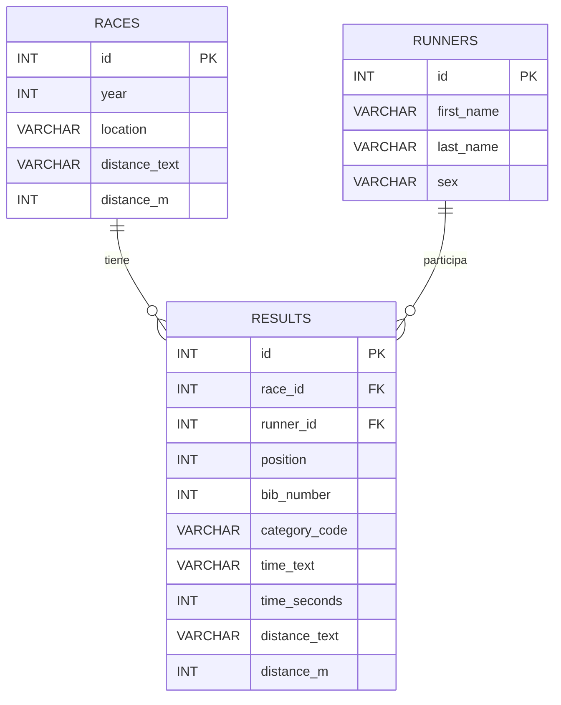

# ERD - Race Analysis Platform

```mermaid
erDiagram
    RACES ||--o{ RESULTS : "tiene"
    RUNNERS ||--o{ RESULTS : "participa"

    RACES {
        INT id PK
        INT year
        VARCHAR location
        VARCHAR distance_text
        INT distance_m
    }

    RUNNERS {
        INT id PK
        VARCHAR first_name
        VARCHAR last_name
        VARCHAR sex
    }

    RESULTS {
        INT id PK
        INT race_id FK
        INT runner_id FK
        INT position
        INT bib_number
        VARCHAR category_code
        VARCHAR time_text
        INT time_seconds
        VARCHAR distance_text
        INT distance_m
    }
```
